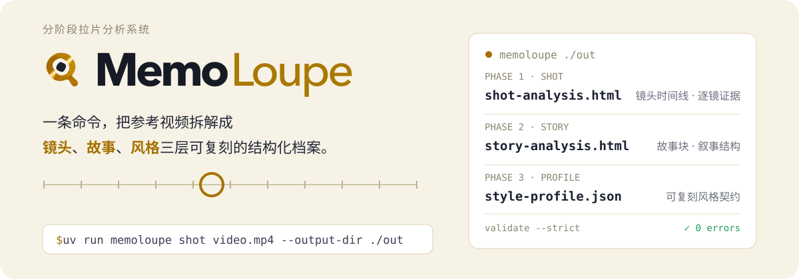

<p align="center">
  
</p>

<p align="center">
  English | <a href="README.zh-CN.md">中文</a>
</p>

MemoLoupe is a **film-analysis （拉片） tool**: give it a reference video, and it dissects the video into three structured profiles — shots, story, and style — reviewed by you and ready to guide remakes of similar content.

## What you get

| Command | Output | Contents |
|---|---|---|
| `memoloupe shot` | `shot-analysis.html` | Unified review workbench: dual story/shot timeline — content, camera, lighting and sound per shot, each linked back to its evidence |
| `memoloupe story` | `story-analysis.html` | Story structure: story blocks, narrative slots and their relations; also merged into the workbench's dual timeline, where human review happens |
| `memoloupe profile` | `style-profile.json` | Style profile: structure/pacing/style distributions and remake notes (machine-readable contract) |

Every conclusion in the HTML links back to raw evidence (clips, frames, audio segments). Anything the model is unsure about is explicitly marked — never dressed up as fact.

## Quick start

Requirements: Python 3.12+, [uv](https://docs.astral.sh/uv/), ffmpeg. On macOS (Apple Silicon) you can additionally enable local ASR and Apple Vision camera-motion analysis.

```bash
# 1. Install
uv sync
uv sync --extra asr-local   # optional: local ASR (FireRedVAD + MLX Whisper)

# 2. Connect your model provider (interactive; API key goes to the OS
#    Keychain, never to a plaintext file)
uv run memoloupe connect add qwen     # or: connect add mimo
uv run memoloupe connect status       # inspect; connect test runs a health check

# 3. Run the three stages (pipelines automatically use the active provider;
#    without one they degrade explicitly while deterministic analysis
#    is unaffected)
uv run memoloupe shot    ./video.mp4 --output-dir ./out
uv run memoloupe story   --output-dir ./out
uv run memoloupe profile --output-dir ./out

# 4. Validate artifacts (schema + cross-file consistency + HTML semantics)
uv run memoloupe validate ./out --strict

# 5. Review
open ./out/shot-analysis.html                    # or just open it in a browser
uv run memoloupe review --output-dir ./out       # localhost review UI
```

Prefer environment variables over `connect`? The legacy env path still works and is used when no active provider exists:

```bash
cp .env.example .env   # fill in MEMOLOUPE_TEXTMODEL__* / MEMOLOUPE_UNIFIEDMODEL__*
uv run memoloupe shot ./video.mp4 --output-dir ./out --env-file .env
```

## How it works

1. **Deterministic detection first** — cuts, BGM, audio cut points, quality and camera motion are measured by detectors (Apple Vision, ffmpeg); models cannot override this evidence.
2. **Models only do semantics** — a multimodal model (MiMo or any OpenAI-compatible endpoint) describes shot content / sound / editing function; ASR can run fully locally (FireRedVAD speech separation + MLX Whisper); the text model only distills story and profile from **text** and never receives video or frames.
3. **Controlled vocabulary + five-state values** — semantic fields normalize to a fixed vocabulary, and every value distinguishes "measured absent / model-claimed absent / unverifiable".
4. **Human review loop** — story results merge into the same workbench as a dual timeline; corrections live as an overlay and survive re-runs.

## Scope

Output stops at the artifacts above. Story-spine generation, footage matching, automatic rough cuts and FCPXML export are **out of scope** — they belong to downstream consumers.

## Docs & development

- Design & contract docs: [`docs/`](docs/) (start from `00_REPRODUCTION_SPEC.md`)
- Contributor / AI-agent guide: [`AGENTS.md`](AGENTS.md)
- Tests: `uv run pytest` (unit + contract + integration + e2e)
- Real-service integration tests: opt in via `MEMOLOUPE_RUN_REAL_SERVICE_TESTS=1` (off in CI by default)
