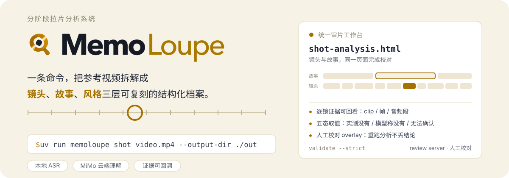

<p align="center">
  
</p>

<p align="center">
  <a href="README.md">English</a> | 中文
</p>

MemoLoupe 是一个**拉片分析工具**：给它一段参考视频，它把视频拆解成三层结构化档案——镜头、故事、风格——供你校对后用于复刻同类内容的创作。

## 你会得到什么

| 命令 | 产物 | 内容 |
|---|---|---|
| `memoloupe shot` | `shot-analysis.html` | 合并分析（镜头 + 故事）：双轨时间线审片工作台，每个镜头的内容、运镜、光线、声音，逐镜可回看证据 |
| `memoloupe profile` | `style-profile.json` | 风格档案：叙事/节奏/风格的分布与复刻要点（机器可读契约） |

所有结论都能在 HTML 里点回原始证据（clip、帧、音频段），模型拿不准的地方会明确标记，不会伪装成确定结论。

## 快速开始

环境要求：Python 3.12+、[uv](https://docs.astral.sh/uv/)、ffmpeg。macOS（Apple Silicon）可额外启用本地 ASR 与 Apple Vision 运镜分析。

```bash
# 1. 安装
uv sync
uv sync --extra asr-local   # 可选：本地语音识别（FireRedVAD + MLX Whisper）

# 2. 连接模型服务（交互式；API key 存系统 Keychain，绝不写入明文文件）
uv run memoloupe connect add qwen     # 或：connect add mimo
uv run memoloupe connect status       # 查看连接；connect test 做健康检查

# 3. 分析（shot 完成后自动继续 story，一条命令跑完；管道自动使用当前
#    provider，未配置时对应步骤显式降级，确定性分析不受影响）
uv run memoloupe shot    ./video.mp4 --output-dir ./out

# 4. 导出风格档案（用于复刻）
uv run memoloupe profile --output-dir ./out

# 5. 校验产物（schema + 跨文件一致性 + HTML 语义）
uv run memoloupe validate ./out --strict

# 6. 查看与校对
open ./out/shot-analysis.html                    # 合并工作台：镜头 + 故事双轨
uv run memoloupe review --output-dir ./out       # localhost 人工校对界面
```

不想用 `connect`？传统环境变量配置仍然可用（无 active provider 时生效）：

```bash
cp .env.example .env   # 填入 MEMOLOUPE_TEXTMODEL__* / MEMOLOUPE_UNIFIEDMODEL__*
uv run memoloupe shot ./video.mp4 --output-dir ./out --env-file .env
```

## CLI 参考

全局：所有命令都接受 `--env-file PATH` 加载 `.env`（不覆盖进程已有的环境变量）。

| 命令 | 作用 | 常用选项 |
|---|---|---|
| `connect add qwen\|mimo` | 连接模型服务；交互式，API key 存系统 Keychain | `--api-key-env ENV`、`--base-url`、`--media-model`、`--text-model`、`--asr-model`（非交互） |
| `connect status` / `test` / `switch` / `remove` / `list` | 查看、健康检查、切换、删除连接 | `test [provider]` 默认测当前 provider |
| `shot VIDEO --output-dir DIR` | Phase 1+2 合并流程：镜头分析后自动继续故事分析（`--skip-story` 退出合并；`--story-only` 只重跑故事，如镜头校对修正后） | `--skip-story`、`--story-only`、`--allow-draft`、`--scaffold-only`、`--max-blocks N`、`--mock-text-model`、`--gap-ms N`、`--skip STEP`、`--dry-run`、`--render-only`、`--strict`、`--max-shots N`、`--force STEP`、`--no-cache`、`--align-shot-boundaries-to-audio`、`--mock-services`、`--json-report` |
| `profile --output-dir DIR` | Phase 3：风格档案（需 story 产物） | `--skip-distill`、`--mock-text-model`、`--strict` |
| `review --output-dir DIR` | localhost 人工校对界面 | `--port 8765` |
| `import-corrections FILE --output-dir DIR` | 导入离线校对结果并重渲染 | |
| `validate DIR` | 校验产物（schema + 跨文件 + HTML 语义） | `--strict`、`--json-report` |
| `config` | 输出脱敏后的有效配置，并列出未配置的服务 | |

模型配置解析顺序：**active provider（connect）→ 环境变量/`.env` → 显式降级**。ASR 由 `asr.provider` 控制：`auto`（本地优先，其次远程，否则显式降级）、`local-fireredvad-mlx`、`openai-json`（默认）、`openai-multipart`、`mimo-chat`（MiMo chat ASR；`connect add mimo` 时自动配置）、`qwen-chat`（Qwen chat ASR，qwen3-asr-flash；`connect add qwen` 时自动配置）。

退出码：`0` 完成（允许警告）· `2` 参数/配置错误 · `3` 输入/契约错误 · `4` ffmpeg/ffprobe 不可用 · `5` 阶段失败 · `6` 校验失败。

## 它是怎么工作的

1. **确定性检测先行**——切镜、BGM、音频切点、质量、运镜由检测器实测（Apple Vision、ffmpeg），模型无法覆盖这些证据；
2. **模型只做语义**——多模态模型（MiMo 或任意 OpenAI 兼容端点）分析镜头内容/声音/剪辑功能；ASR 可完全本地运行（FireRedVAD 人声分离 + MLX Whisper）；文本模型只做 story 与 profile 的**文本**蒸馏，绝不接收视频或帧；
3. **受控词表 + 五态取值**——语义字段归一化到固定词表，每个值区分"实测没有 / 模型称没有 / 无法确认"；
4. **人工校对闭环**——story 结果与镜头合并为同一工作台的双轨时间线，校对结果以 overlay 形式叠加，重跑分析不会丢失。

## 产品边界

输出止于上面三个文件。Story Spine 生成、素材匹配、自动粗剪、FCPXML 导出**不属于本仓库**，它们是下游消费者。

## 文档与开发

- 设计与契约文档：[`docs/`](docs/)（从 `00_REPRODUCTION_SPEC.md` 开始）
- 贡献者/AI 协作者指南：[`AGENTS.md`](AGENTS.md)
- 测试：`uv run pytest`（单元 + 契约 + 集成 + e2e）
- 真实服务联调测试：`MEMOLOUPE_RUN_REAL_SERVICE_TESTS=1` 显式启用（默认不进 CI）
